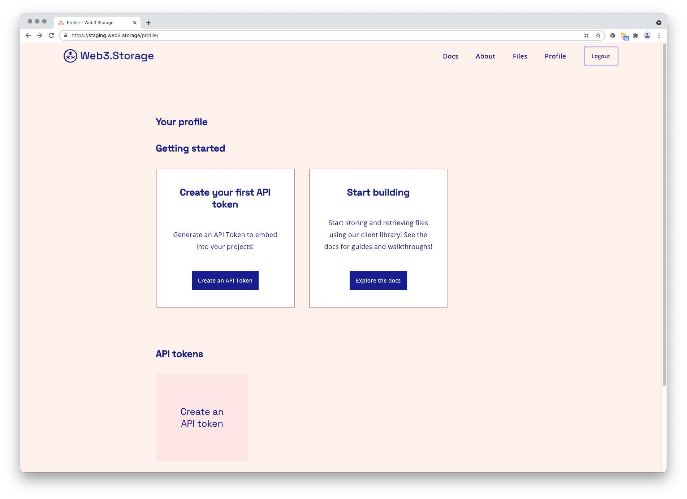
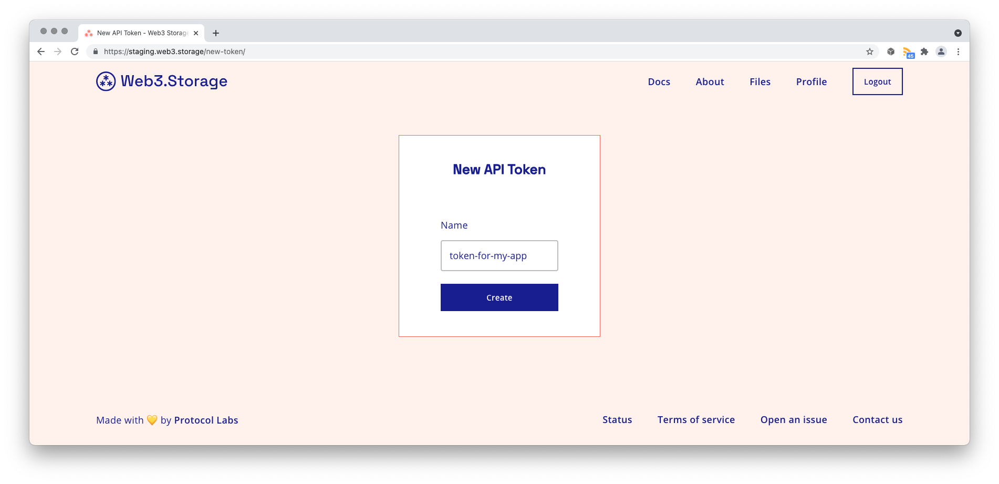
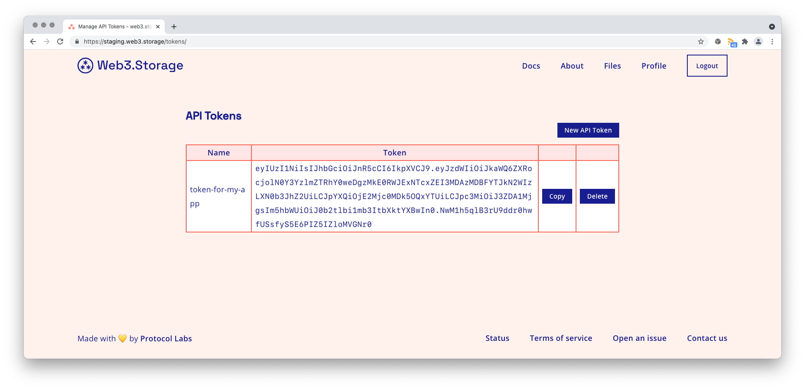

# How to generate an API token

In this how-to guide, **you'll learn how to generate a Web3.Storage API token** so that you can interact with the service programmatically through the [JavaScript client library](../reference/client-library.md) or using the command line.

You'll need a free Web3.Storage account in order to generate an API token. If you already have an account, read on. If not, have a look at the [quickstart guide](../README.md#quickstart) to get up and running in just a few minutes.

## Create a new token

1. From the Web3.Storage navigation menu, click **Profile** to go to your [profile page](https://web3.storage/profile).
1. Scroll down to the **API tokens** section and click **Create an API token**. (If you've never created an API token on Web3.Storage before, you'll also see an invitation to do this from the **Getting started** section of your profile page.)

3. Give your new API token a descriptive name that will be easy for you to remember later.

:::tip
You don't have to use the same API token for all of your projects! Creating an individual API token for each of your applications or services makes it easier to change or revoke access in the future to a specific project. You can have as many tokens as you need on Web3.Storage for free.
:::

4. Click **Create**. You'll then be taken to your [API Tokens](https://web3.storage/tokens) page, where you can manage all of your Web3.Storage API tokens.

5. Make a note of the **Token** field somewhere secure where you know you won't lose it. You can click **Copy** to copy your new API token to your clipboard.
