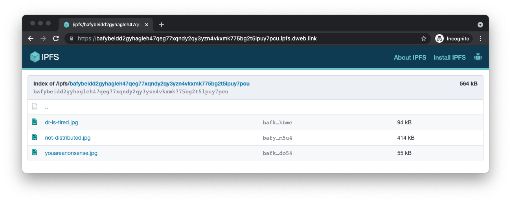

# Retrieve

TODO: intro paragraph

## Using the Web3.Storage client

TODO: show how to use `client.get`

## Using an IPFS HTTP gateway

You can easily fetch any data stored using Web3.Storage using an HTTP gateway. Because IPFS is a peer-to-peer, decentralized network, you can use any public gateway to fetch your data. In this guide, we'll use the gateway at `dweb.link`, but you can check the [list of public gateways](https://ipfs.github.io/public-gateway-checker/) to find the best one for your needs.

When you [store data using the Web3.Storage client][howto-store], the `put` method returns an [IPFS content identifier (CID)][ipfs-docs-cid] string. That CID points to an IPFS directory that contains all the files passed in to the `put` method.

You can view a listing of all the files in the directory using an IPFS gateway by creating a gateway URL. For example, if your CID is `bafybeidd2gyhagleh47qeg77xqndy2qy3yzn4vkxmk775bg2t5lpuy7pcu`, you can make a URL for the gateway at `dweb.link`: [dweb.link/ipfs/bafybeidd2gyhagleh47qeg77xqndy2qy3yzn4vkxmk775bg2t5lpuy7pcu](https://dweb.link/ipfs/bafybeidd2gyhagleh47qeg77xqndy2qy3yzn4vkxmk775bg2t5lpuy7pcu).

If you follow the link, you should see a page similar to this:



To link directly to a file within the bundle, just add the file path after the CID portion of the link. For example: [dweb.link/ipfs/bafybeidd2gyhagleh47qeg77xqndy2qy3yzn4vkxmk775bg2t5lpuy7pcu/not-distributed.jpg](https://dweb.link/ipfs/bafybeidd2gyhagleh47qeg77xqndy2qy3yzn4vkxmk775bg2t5lpuy7pcu/not-distributed.jpg)

## Using the IPFS command line

If you have the [IPFS command line interface][ipfs-docs-cli-quickstart] installed, you can use it directly to fetch data without going through a gateway:

```bash
# get the whole bundle and save to a directory:
ipfs get bafybeidd2gyhagleh47qeg77xqndy2qy3yzn4vkxmk775bg2t5lpuy7pcu

# get a specific file out of the bundle:
ipfs get bafybeidd2gyhagleh47qeg77xqndy2qy3yzn4vkxmk775bg2t5lpuy7pcu/youareanonsense.jpg
```

<!-- internal links -->
[howto-store]: ./store.md

<!-- external links -->
[ipfs-docs-cid]: https://docs.ipfs.io/concepts/content-addressing/
[ipfs-docs-cli-quickstart]: https://docs.ipfs.io/how-to/command-line-quick-start/
